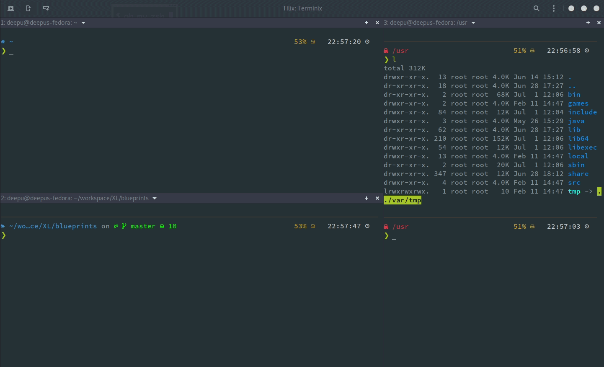
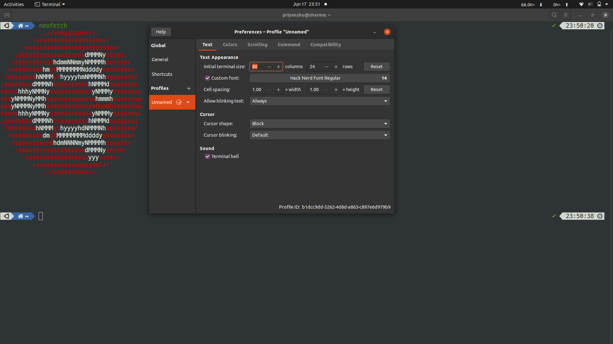
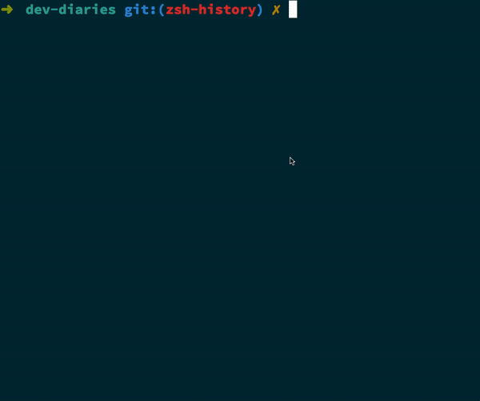
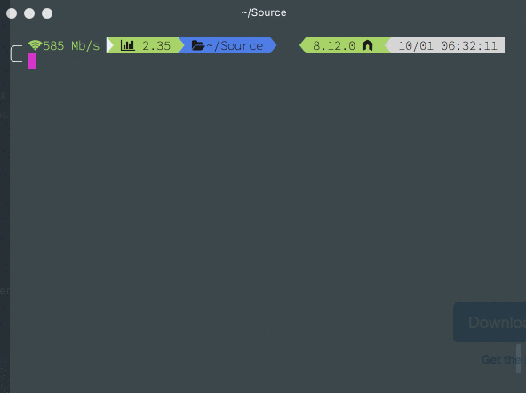
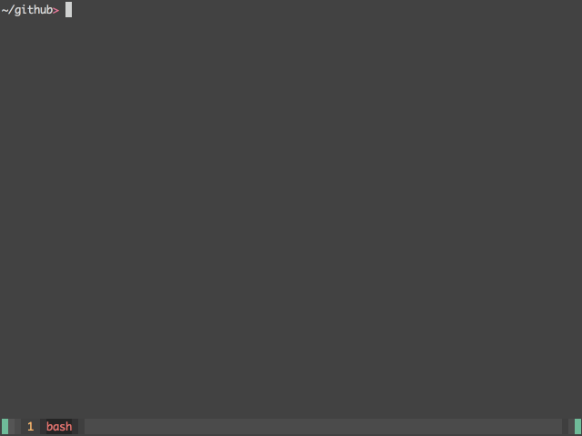

## Install ``zsh``

* via curl  
``sh -c "$(curl -fsSL https://raw.githubusercontent.com/ohmyzsh/ohmyzsh/master/tools/install.sh)"``
* via wget  
``sh -c "$(wget -O- https://raw.githubusercontent.com/ohmyzsh/ohmyzsh/master/tools/install.sh)"``

## Install ``Nerd Font``

* Go to ``https://github.com/ryanoasis/``
nerd-fonts/blob/master/patched-fonts/Hack/Regular/complete/Hack%20Regular%20Nerd%20Font%20Complete.ttf
* Download any font you prefer but make sure it support all the icons and characters required by powerlevel10k.``hack`` is strongly recommended.
* Install the **.tff** file.

## Config terminal

* Open ``preferences`` in your terminal
* Select ``Hack Font`` in ``Text`` section
* Unselect ``use color from system theme`` in ``color`` tab and select ``tango dark`` or ``colorized dark`` for bulit-in schemes option

## Install ``Powerlevel10k``

``git clone --depth=1 https://github.com/romkatv/powerlevel10k.git ${ZSH_CUSTOM:-~/.oh-my-zsh/custom}/themes/powerlevel10k``
* By default a installation prompt will begin, but if it doesn't use ``p10k configure``. You can use it later also to try all the different themes and options
* Activate powerlevel10k by changing the default theme to ``ZSH_THEME="powerlevel10k/powerlevel10k"`` in ``~/.zshrc``

## Install ``Zsh-autocomplete``

``git clone https://github.com/zsh-users/zsh-autosuggestions ${ZSH_CUSTOM:-~/.oh-my-zsh/custom}/plugins/zsh-autosuggestions``
* Add the plugin to the list of plugins inside ~/.zshrc  ``plugins=( [plugins...] zsh-autosuggestions)``
* Activate the plugin by ``source ~/.zshrc``

## Install ``Zsh-syntaxhighlighting``

``git clone https://github.com/zsh-users/zsh-syntax-highlighting.git ${ZSH_CUSTOM:-~/.oh-my-zsh/custom}/plugins/zsh-syntax-highlighting``
* Add the plugin to the list of plugins inside ~/.zshrc  ``plugins=( [plugins...] zsh-syntax-highlighting)``
* Activate the plugin by ``source ~/.zshrc``

## Install ``fzf``

``git clone --depth 1 https://github.com/junegunn/fzf.git ~/.fzf``
``~/.fzf/install``
* Use ``ctrl + r`` to search for last executed commands
* Use ``ctrl + t`` to search for files
